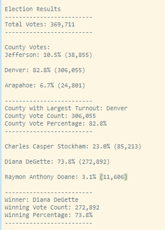

# Election-Analysis

## Overview of Election Audit:

### Objective

The purpose of this project it to conduct election audit of a recent local congressional election using Python. Some of the metrics/data we need to capture are:
1.	Total number of votes cast.
2.	Complete list of candidates who received votes.
3.	Total number of votes each candidate received.
4.	Percentage of votes each candidate won.
5.	Determine the winner of the election based on popular vote.

### Resources
- Data Source: election_results.csv
- Software: Python 3.6.1, Visual Studio Code, 1.63.0

## Election-Audit Results: 

The analysis of the election show that:

- There were 369,711 total votes cast in the election.

### Candidate Summary

- The candidates were:
  - Charles Casper Stockham
  - Diana DeGette
  - Raymon Anthony Doane
  
- The candidate results were:
  - Casper Stockham received 23.0% of the votes for a total of 85,213 votes.
  - Diana DeGette received 73.8% of the votes for a total of 272,892 votes.
  - Raymon Anthony Doane received 3.1% of the votes for a total of 11,606 votes.

- The winner of the election was:
  - Diana DeGette who received 73.8% of the votes for a total of 272,892 votes.

### County Summary

- The counties that participated in the voting were:
  - Jefferson
  - Denver
  - Arapahoe

- The voting results by the county were:
  - Jefferson county cast 10.5% of the votes for a total of 38,855 votes.
  - Denver county cast 82.8% of the votes for a total of 306,055 votes.
  - Arapahoe county cast 6.7% of the votes for a total of 24,801 votes.

- The county with the largest representation in the election was:
  - Denver county which represented 82.8% of the votes for a total of 306,055 votes.

    

## Election Audit Summary: 
While the script provided us with detailed information about this election, we can also leverage it to summarize data about other elections, with some minor modifications. Some of the potential applications could be:

1. Analyzing presidential elections - for this we would need to replace the countries with states. 

2. Analyzing historical election trends over time - for this we would need to add election year to the election results csv file. 

3. Analyzing election results for any given year - for this we would need to add a user-input variable to select a year and add a conditional statement validating that the records match the year selected by the user.

4. Analyzing diversity trends over time - in additional to the election year, we would need to add the candidate demographic information, such as race and gender. We could then analyze the diversity makeup of the candidates and how support of various minorities has been changing over time.

